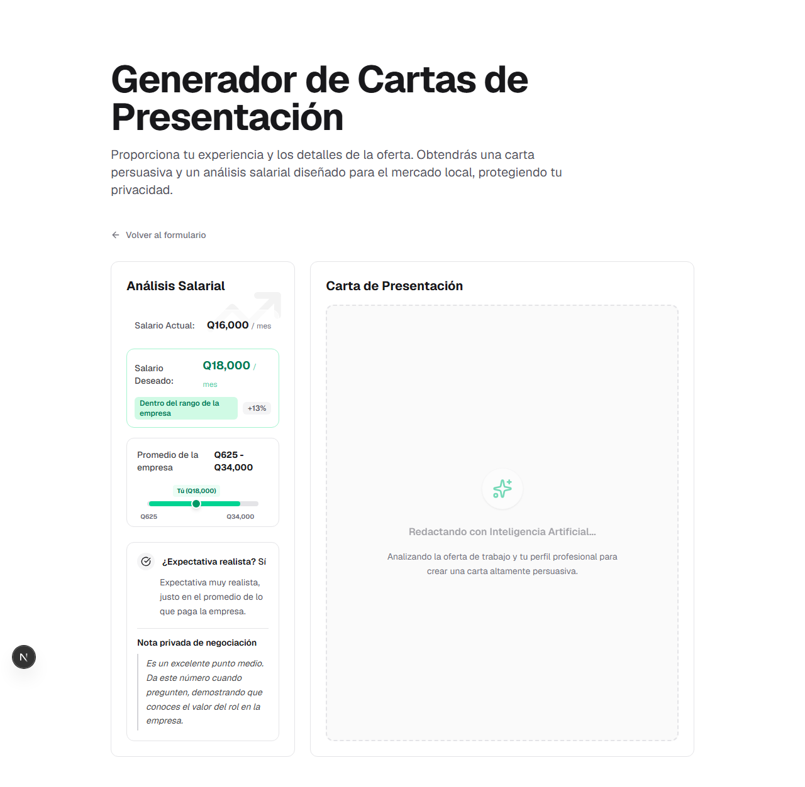
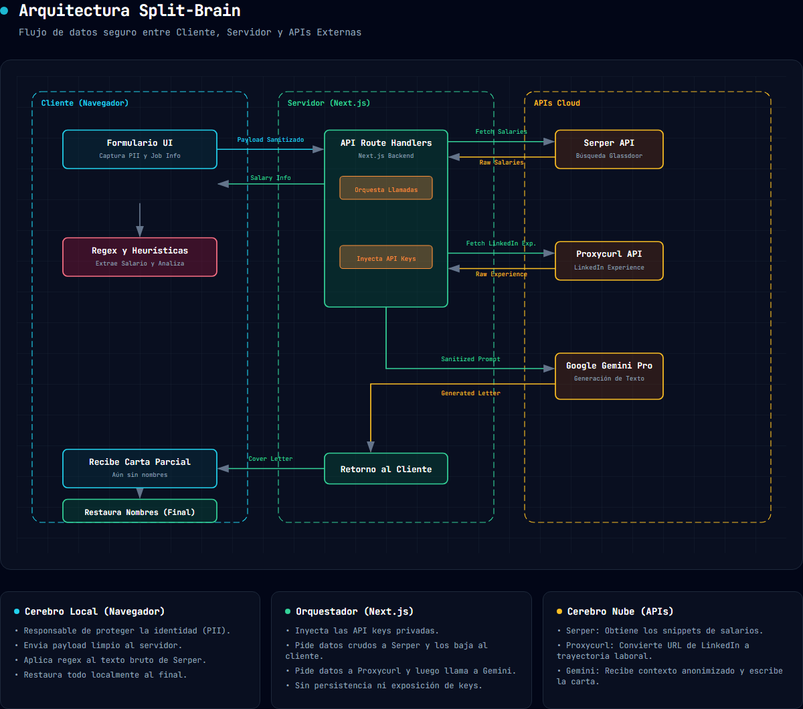

# Generador de Cartas de Presentación — Arquitectura *Split Brain*

Genera cartas de presentación altamente persuasivas para aplicar a ofertas laborales, sin comprometer tu privacidad. A diferencia de un ChatGPT genérico, la aplicación utiliza una arquitectura *split brain* ("cerebro dividido") para asegurar que tu información sensible nunca llegue a los modelos de inteligencia artificial externos, mientras te ofrece retroalimentación valiosa en tiempo real.

## Demo

### 1. Ingreso de Datos


### 2. Carta Generada y Análisis Salarial



## Qué hace la aplicación

Ingresas los datos del puesto al que aplicas, la empresa, tus años de experiencia y tus expectativas salariales. También puedes, opcionalmente, ingresar tu nombre, perfil de LinkedIn y más información. La aplicación:
1. Evalúa si tu expectativa salarial es realista comparándola con datos reales de la empresa en Glassdoor, dándote consejos de negociación.
2. Extrae tu experiencia relevante desde tu LinkedIn (si lo provees).
3. Escribe una carta de presentación persuasiva, adaptada a la oferta, usando Gemini Pro.

## Arquitectura Split Brain en pocas palabras

**Qué es.** La aplicación reparte el trabajo entre la computadora del usuario (el navegador web) y un backend conectado a la nube. En nuestra implementación, lo que exige razonamiento y redacción se delega a modelos grandes de lenguaje en la nube (Gemini Pro), mientras que la manipulación de datos sensibles y las reglas matemáticas o de negocio se manejan localmente o en rutas controladas, usando expresiones regulares o lógica tradicional.

**Por qué dividir.**

| Razón | En esta app |
| --- | --- |
| **Privacidad** | El salario deseado, salario actual y nombre del usuario **nunca** son enviados a Gemini ni a Serper. |
| **Latencia** | El análisis salarial utiliza reglas rápidas locales (regex) para parsear los datos devueltos por Serper, de modo que el usuario puede ver los tips salariales al instante mientras espera que se termine de escribir la carta. |
| **Seguridad** | Las claves de las APIs externas nunca están en el cliente; todas las llamadas pasan por el servidor (Next.js Route Handlers). |

### Los cerebros en el proceso

| Qué sucede | Cerebro | Por qué ahí |
| --- | --- | --- |
| Formulario de captura | Local (Navegador) | Interacción inmediata con el usuario. |
| Sanitización de datos (Quitar nombres) | Servidor (Node.js) | El servidor controla y asegura que la data a la nube no contenga nombres antes de enviar a Gemini o Enrich Layer. |
| Consulta a Glassdoor / Serper | Servidor (Node.js) | Requiere de la API key de Serper (privada). |
| Consulta a LinkedIn / Enrich Layer | Servidor (Node.js) | Requiere de la API key de Proxycurl/Enrich Layer (privada). |
| Análisis de texto de salarios (Regex) | Local (Navegador) | Lógica matemática y parseo rápido sin necesidad de LLM y latencia extra. |
| Creación de la carta de presentación | Nube (Gemini) | Requiere creatividad avanzada para conectar la experiencia con la oferta. |
| Restauración del nombre del usuario | Local (Navegador) | El nombre real solo existe localmente para firmar la carta terminada. |

---

## Arquitectura



### Heurísticas locales: Análisis Salarial sin LLM

Extraer el salario mensual desde textos desordenados de Glassdoor no utiliza IA en absoluto. Para evitar alucinaciones, la extracción se hace localmente utilizando `Regex` y heurísticas matemáticas:

| Lógica | Por qué se hace con código |
| --- | --- |
| Regex para capturar montos, monedas (`USD`, `GTQ`) y modificadores (`K`). | Extracción precisa sin malentendidos (ej: un número K siempre es * 1000). |
| Determinar tipo de salario mensual vs anual y tasa de conversión local (`1 USD = 7.8 GTQ`). | Reglas matemáticas deterministas, a prueba de fallos, instantáneo. |
| Priorizar datos locales en GTQ antes que dólares convertidos. | Evita enviar instrucciones complejas a un modelo, el código toma la mejor decisión según existencia de arrays. |
| Decisión de Negociación (Matriz de porcentajes). | Genera una nota privada específica ("Estás un 30% por debajo") que un modelo podría calcular mal o sesgar. |

**Dónde sucede el split brain:**
En el cliente, los datos se recogen, pero la decisión de qué va a la nube recae en el servidor que orquesta todo en `src/app/api/generate/route.ts`. Antes de pedirle a Gemini que genere la carta, se ejecuta una función sanitizadora:

```typescript
// Sanitize linkedinData to ensure no names or PII are passed to the prompt
let sanitizedLinkedinData = null;
if (linkedinData) {
  sanitizedLinkedinData = JSON.parse(JSON.stringify(linkedinData));
  
  if (sanitizedLinkedinData.name) delete sanitizedLinkedinData.name;
  if (sanitizedLinkedinData.first_name) delete sanitizedLinkedinData.first_name;
  if (sanitizedLinkedinData.last_name) delete sanitizedLinkedinData.last_name;
}
```

---

## Integración con APIs, Costos y Privacidad

### 1. Gemini Pro (Google AI)
- **Uso:** Redactar la carta de presentación persuasiva.
- **Autenticación:** Llamada Server-side a través del SDK `@google/genai`. La credencial vive en la variable de entorno `GEMINI_API_KEY` (`.env.local`). Nunca se expone en el cliente.
- **Manejo de Fallos (Offline):** Si la API falla por timeout o falta de conexión, la interfaz captura el error en el navegador y automáticamente inyecta una plantilla de carta de presentación genérica local (fallback) para que el usuario pueda usarla de todas formas.
- **Costo:** Capa gratuita (Free tier) de Google AI Studio, o ~$0.075 por millón de tokens (usando la familia Flash de Gemini).
- **Payload (Privacidad):** Se envían los años de experiencia, resumen profesional, puesto y empresa. **Nunca** se incluye el nombre del usuario, su salario actual ni sus expectativas (estos últimos nunca tocan las APIs).

### 2. Serper (Google Search API)
- **Uso:** Extraer promedios salariales públicos buscando en portales como Glassdoor.
- **Autenticación:** Server-side route handler. La credencial es `SERPER_API_KEY` (`.env.local`) y se inyecta en el header HTTP `X-API-KEY`.
- **Manejo de Fallos (Offline):** Si la API no responde o devuelve un error, el backend lo maneja y devuelve un arreglo vacío. El frontend detecta la ausencia de datos y entra en un *fallback* heurístico: valida la solicitud analizando matemáticamente si el aumento es ≤ 20% y si cae dentro del rango estándar local (Q15K - Q25K).
- **Costo:** ~$0.001 por llamada.
- **Payload (Privacidad):** Solo se envía la cadena de texto: `"[Puesto] [Empresa] Glassdoor salary Guatemala"`. Sin datos personales.

### 3. Proxycurl / Enrich Layer (LinkedIn Scraper)
- **Uso:** Opcional. Extraer la trayectoria laboral detallada partiendo de un enlace público.
- **Autenticación:** Server-side route handler. Usa la credencial `PROXYCURL_API_KEY` (`.env.local`) pasada por el header `Bearer`.
- **Manejo de Fallos:** Si falla (ej. URL privada o caída del servicio), el backend lo procesa y la aplicación simplemente retrocede a generar la carta usando solo el campo "Acerca de mí" ingresado por el usuario.
- **Costo:** ~$0.015 por petición.
- **Payload (Privacidad):** **Únicamente** se envía la URL pública del perfil. Cuando el payload regresa, el backend borra proactivamente el campo `name` antes de compartir la experiencia con Gemini.

### Los Prompts de Gemini

En la ruta `api/generate/route.ts`, la instrucción enviada al modelo es clara sobre su rol y sus restricciones, en formato *few-shot* pero concisa:

```text
You are an expert career coach and copywriter. Your task is to write a highly compelling, professional, and modern cover letter for a candidate.

**IMPORTANT RULES:**
1. The output MUST be entirely in SPANISH.
2. DO NOT include the candidate's name or any placeholder for a signature at the end. The application will handle the name locally.
3. Be persuasive, highlighting the candidate's value based on the provided information.
4. Keep it concise (3-4 short paragraphs). No fluff.
```
A este prompt se le adjuntan, serializados, los años de experiencia, la empresa, y la trayectoria de LinkedIn anonimizada.

---

## Estructura del Proyecto

```
cover-letter-local
├── src/
│   ├── app/
│   │   ├── api/
│   │   │   ├── generate/route.ts   (Orquestador y Gemini)
│   │   │   ├── linkedin/route.ts   (Enrich Layer proxy)
│   │   │   └── salary/route.ts     (Serper/Glassdoor proxy)
│   │   └── page.tsx                (Frontend del generador y UI)
├── docs/
│   ├── diagrams/                   (Imágenes de arquitectura)
├── AGENTS.md                       (Reglas de comportamiento IA)
├── SPEC.md                         (Especificaciones del producto)
├── PROMPTS.md                      (Flujo de desarrollo original)
└── LOCAL_BRAIN.md                  (Lógica regex de salarios)
```

## Cómo Configurar y Ejecutar

1. **Clonar e Instalar:**
   ```bash
   npm install
   ```

2. **Variables de Entorno:**
   Copiar `.env.example` a `.env.local` y agregar tus API Keys. Ninguna de estas claves llega al navegador.
   ```env
   GEMINI_API_KEY=tu_gemini_key
   PROXYCURL_API_KEY=tu_proxycurl_key
   SERPER_API_KEY=tu_serper_key
   ```
   *(Nota: si dejas las llaves en blanco, los endpoints utilizarán datos precargados ("Mocks") para que puedas evaluar el UI y la lógica de análisis).*

3. **Desarrollo:**
   ```bash
   npm run dev
   ```
   Abre [http://localhost:3000](http://localhost:3000) en el navegador.

4. **Pruebas Automatizadas (Playwright):**
   La aplicación incluye pruebas End-to-End para verificar matemáticamente que los datos sensibles nunca abandonan el dispositivo en el tráfico de red. Para correrlas:
   ```bash
   npx playwright test
   ```
   *Revisa el archivo `AUTOMATED_TESTING.md` para un análisis profundo sobre la arquitectura de estas pruebas.*
