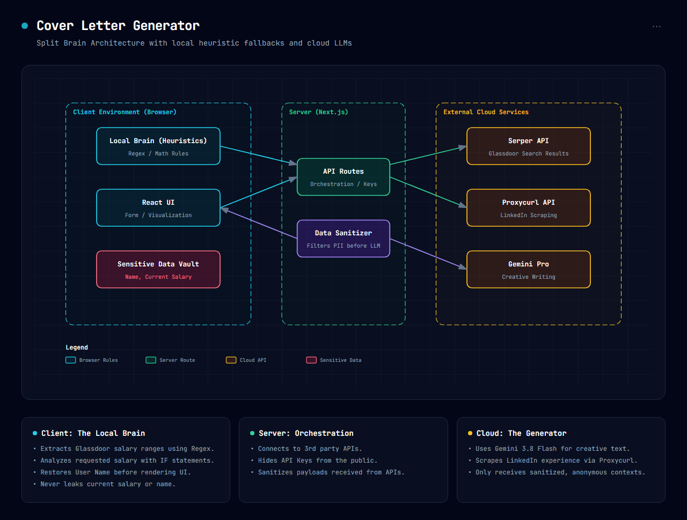
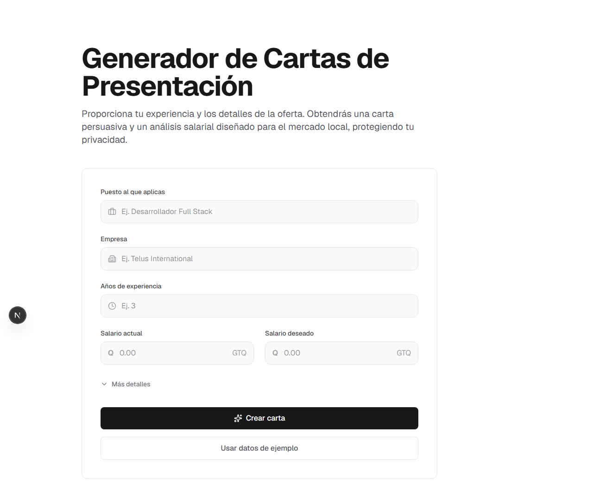

# El "Cerebro Dividido": Cómo procesé datos ultra-privados sin mandarlos a OpenAI o Gemini

Cuando construimos aplicaciones potenciadas por Inteligencia Artificial, casi siempre caemos en el mismo patrón: tomamos todos los datos del usuario, armamos un prompt gigante y lo enviamos a la nube (OpenAI, Anthropic, o Google). Pero, ¿qué pasa cuando esos datos son **tu salario actual y tus aspiraciones económicas**?

Como desarrollador, me enfrenté a esta situación al construir un **Generador de Cartas de Presentación**. Quería que la IA me ayudara a redactar una carta persuasiva y a analizar si mi expectativa salarial era realista, pero me negaba rotundamente a enviar mis datos financieros privados o mi nombre real a un modelo en la nube. 

La solución no fue abandonar la IA, sino repensar cómo la usamos a través de una arquitectura llamda **Split Brain**.

---

## ¿Qué es la Arquitectura Split Brain?

En términos simples, el **Split Brain** consiste en dividir la "inteligencia" de tu aplicación. Asignas las tareas creativas pesadas a un Large Language Model (LLM) en la nube, y reservas el análisis de los datos críticos a un "cerebro local" que funciona en el dispositivo del usuario.

El detalle más importante al implementar esta arquitectura: **un "cerebro local" no necesita ser una red neuronal ni un LLM**. A veces el mejor cerebro local es código tradicional, expresiones regulares (`regex`) y simples condicionales (`if/else`).

---

## Nuestro Primer Intento: El Fracaso del LLM Local

Originalmente, mi idea para garantizar la privacidad consistía en correr un LLM completamente dentro del navegador del usuario usando WebGPU. Si los datos del usuario nunca dejan su navegador, estarán a salvo. 

Probamos de todo:
- Intentamos cargar `Qwen2.5-1.5B` usando WebLLM. **Fallo:** La computadora se quedó sin memoria de video al intentar ejecutarlo.
- Intentamos usar la familia `Gemma-2-2B` en formato cuantizado (`q4f16`). **Fallo fatal:** Encontramos repetidamente el error `DXGI_ERROR_DEVICE_HUNG`. Windows tiene un límite estricto de tiempo para la ejecución de shaders en la tarjeta gráfica (TDR timeout de 2 segundos). El modelo era demasiado pesado y Windows reiniciaba el driver gráfico.
- Forzamos la ejecución en CPU usando WebAssembly (WASM). **Fallo:** La aplicación fallaba silenciosamente, pasaban minutos sin generar un solo token.
- Al final, solo logramos correr modelos muy pequeños como `Qwen 0.5B`. No crasheaban, pero al ser tan pequeños alucinaban palabras sin sentido o ignoraban las instrucciones, siendo inútiles para escribir una carta profesional.

**¿Por qué no correrlo en un servidor propio?**
Hubiera funcionado, pero alquilar GPUs dedicadas para un tech demo es costoso. Además, mandar el salario actual del usuario a nuestro servidor seguía rompiendo la promesa de privacidad: los datos seguían saliendo del navegador.

---

## La Solución Elegante: Regex como "Cerebro Local"

En nuestra implementación final, el flujo funciona así:

1. **Recolección de Datos (Serper):** Cuando ingresas a qué empresa aplicas, nuestro backend utiliza la API de Serper para realizar una búsqueda en Google y extraer fragmentos de Glassdoor con los salarios públicos de esa empresa. El backend devuelve al navegador ese texto crudo.
2. **Análisis Privado (Cerebro Local):** El navegador del usuario recibe ese texto crudo. Escribimos expresiones regulares (Regex) para analizar la respuesta. Nuestro código local extrae los números, identifica si están en Quetzales (GTQ) o Dólares (USD), y si son salarios mensuales o anuales.
3. **Toma de Decisiones (Heurística):** Nos dimos cuenta de que la data en USD en Guatemala solía estar distorsionada, así que programamos una regla simple: *Si hay datos en GTQ, ignora los USD por ser menos confiables*. Luego, con simples operaciones matemáticas, evaluamos si el aumento salarial que el usuario busca es menor al 20% y encaja en los promedios extraídos. Todo esto ocurre instantáneamente en el navegador, tu salario nunca sale de este.
4. **La Creatividad (Gemini):** Paralelamente, el backend envía a Gemini Pro únicamente tu experiencia profesional anónima (extraída de LinkedIn mediante Proxycurl) y el puesto al que aplicas, para que redacte la carta de presentación. **Ni tu nombre, ni tus salarios van en el payload.**
5. **Ensamblaje Final:** Cuando Gemini devuelve la carta, el navegador inserta tu nombre real localmente y la muestra en pantalla.

### El Resultado en Acción

*El formulario donde se ingresa la data sensible que nunca saldrá del dispositivo.*

*El resultado: Una carta persuasiva redactada por IA en la nube, y un análisis salarial calculado matemáticamente en el cliente.*

## Lo que Aprendimos

El error más común actualmente es querer solucionar con Inteligencia Artificial un problema que realmente no la necesita.

Intentar usar una IA local paraa hacer razonamiento matemático y comparaciones salariales causó retrasos en el proyecto debido a los errores que esta generaba (errores de WebGPU, reinicios de drivers, etc.). Al final, unas buenas expresiones regulares (`Regex`) y condicionales lógicos probaron ser más rápidos, 100% privados y asombrosamente eficientes para el "Cerebro Local", dejándole a la IA en la nube únicamente lo que hace mejor: escribir textos creativos y persuasivos.

Implementar una arquitectura **Split Brain** no solo protegió los datos sensibles, sino que bajó la latencia, redujo los costos a fracciones de centavo, y nos dio un control absoluto sobre la lógica del negocio.
